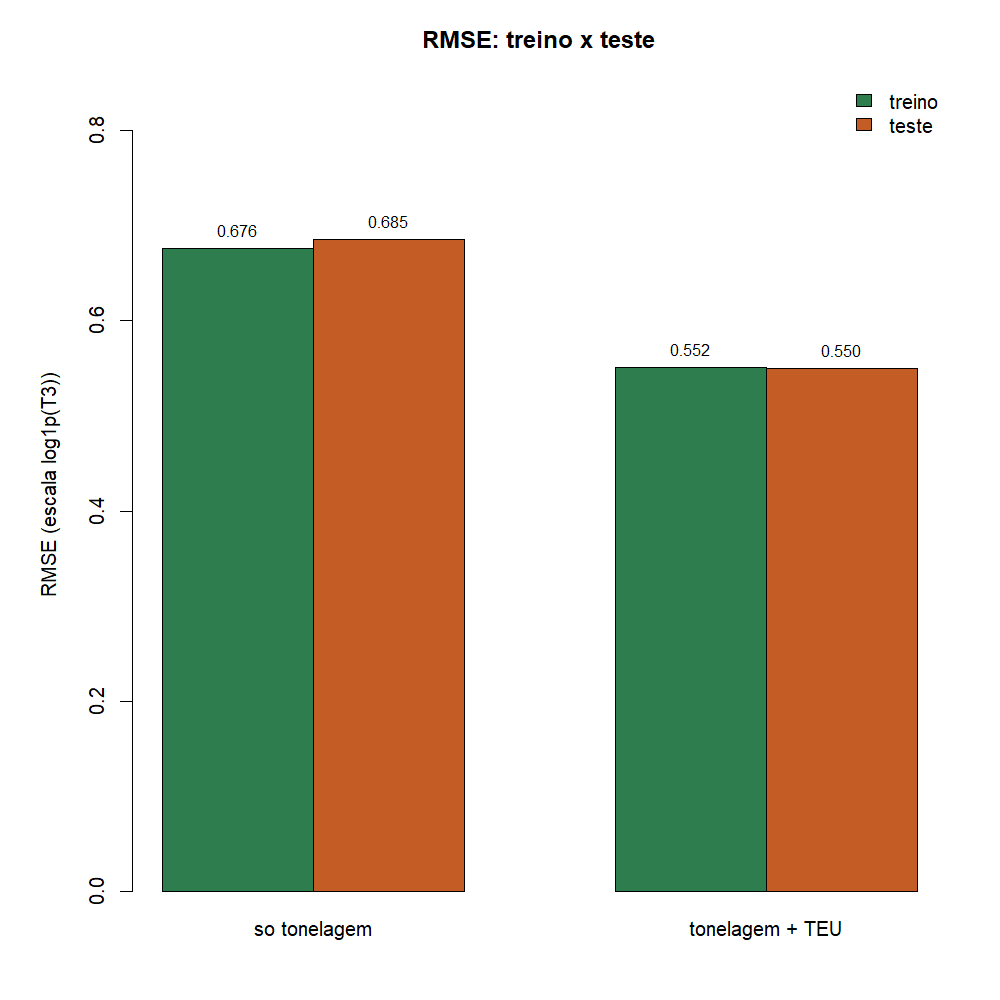
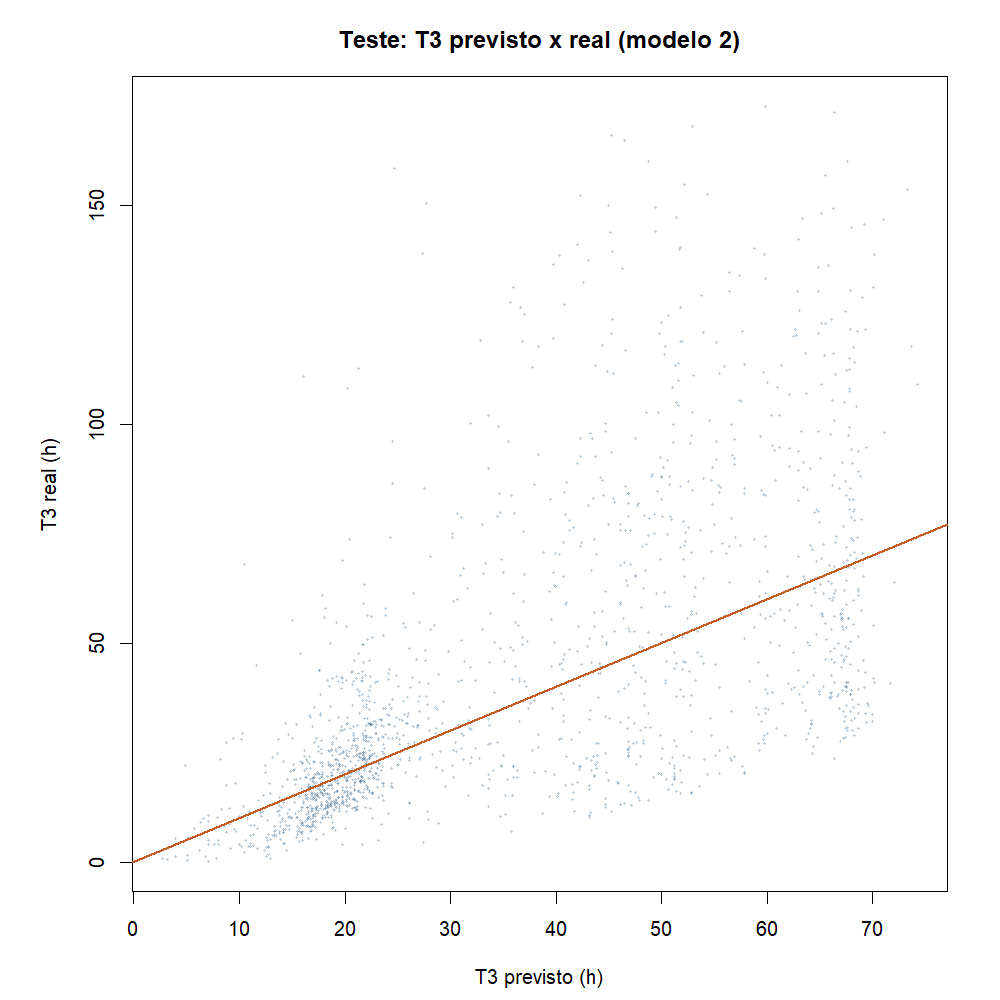
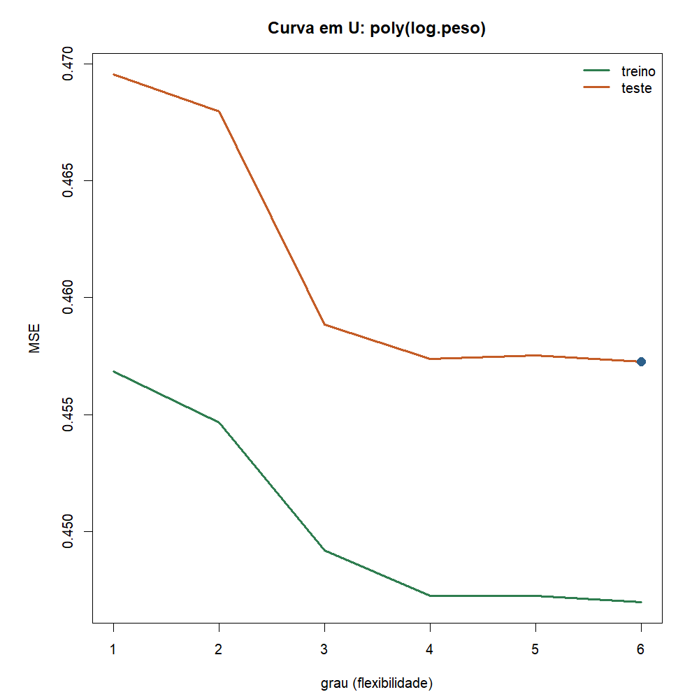

# Atividade 05 - Avaliação e seleção de modelos

**Team Shannon · Teoria do Aprendizado Estatístico · Fatec Rubens Lara · Aula 06**

Continua a [03a](03a-regressao-linear-t3.md): já ajustamos dois `lm`
(só tonelagem; tonelagem + TEU). Agora a pergunta da
[Aula 06](../materiais-aulas/Aula%2006%20-%20Avaliação%20e%20Seleção%20de%20Modelos.PDF)
é outra: **qual dos dois generaliza melhor?**

Script: [`05-avaliacao-selecao-modelos.R`](../estrutura/codigos/05-avaliacao-selecao-modelos.R).
Números: [`05-numeros.txt`](../estrutura/codigos/05-numeros.txt).

---

## O funil

| # | Etapa | O que fizemos |
|---|---|---|
| 01 | Base | [Dicionário](01-dicionario-variaveis.md) |
| 02a / 02b | Análise Exploratória | ampla e tempos T1-T4 |
| 03a / 03b | T3 em horas | reta e previsão na fila |
| 04 | T3 sim/não | regressão logística |
| 05 | Escolher o modelo | **esta entrega**: treino / teste + RMSE |

---

## Recorte (igual à 03a)

- Santos, 2024, movimentação de carga
- peso > 0, T3 preenchido, T3 acima do P99 cortado
- n = 5.681 escalas

| Papel | Variável |
|---|---|
| Y | `log1p(T3)` |
| X1 | `log1p(peso)` |
| X2 | `log1p(teu)` |

---

## Protocolo da Aula 06

Regra de ouro: o modelo **nunca vê o teste** antes da nota final.

1. Dividir 70/30 **antes** de qualquer `lm`
2. Ajustar os dois candidatos **só no treino**
3. Comparar no **teste** (RMSE)
4. Escolher um e traduzir o erro para o porto

```r
set.seed(1)
itr <- sample(nrow(dados), round(0.7 * nrow(dados)))
tr <- dados[itr, ]
te <- dados[-itr, ]

m1 <- lm(y ~ log.peso, data = tr)
m2 <- lm(y ~ log.peso + log.teu, data = tr)

mse <- function(m, d) mean((d$y - predict(m, d))^2)
sqrt(c(m1 = mse(m1, te), m2 = mse(m2, te)))
```

| Conjunto | n | Papel |
|---|---:|---|
| Treino | 3.977 (70%) | ajusta `lm` |
| Teste | 1.704 (30%) | reporta o erro (uma vez) |

`set.seed(1)` deixa a divisão reproduzível.

---

## Dois candidatos (os mesmos da 03a)

| Modelo | Fórmula | Flexibilidade |
|---|---|---|
| m1 | `y ~ log.peso` | só tonelagem |
| m2 | `y ~ log.peso + log.teu` | tonelagem + TEU |

Não usamos o teste para escolher o grau nem o limiar. Ele fica trancado
até o passo 3.

---

## Resultado no teste



| Modelo | RMSE treino | RMSE teste | MAE teste (horas) |
|---|---:|---:|---:|
| só tonelagem (m1) | 0,676 | 0,685 | ~22,5 h |
| tonelagem + TEU (m2) | 0,552 | 0,550 | ~18,3 h |

Leitura:

- Do m1 para o m2 o erro de **teste** cai. Incluir TEU ajuda de verdade,
  não só no treino.
- Treino e teste ficam perto um do outro. Com n grande, estes dois
  candidatos não estão "decorando" a lista.

**Vencedor: m2 (tonelagem + TEU).**

### Frase para o porto

No teste, o modelo com peso e TEU erra o T3, em média absoluta, cerca de
**18 horas**. É melhor que o modelo só com tonelagem (~22 h), mas ainda
é uma ordem de grandeza, não um horário fechado - a Análise Exploratória
já tinha mostrado cauda longa.



A nuvem acompanha a diagonal, com espalhamento. Confirma o MAE: dá para
ordenar escalas, não cravar minuto.

---

## Curva em U (flexibilidade só na tonelagem)

A Aula 06 mostra o U variando o grau do polinômio. Fizemos o mesmo com
`poly(log.peso, g)`, g de 1 a 6, medindo MSE no treino e no teste:



Com n = 5.681 o U fica quase plano nesta faixa: subir o grau só de
tonelagem muda pouco o teste. O salto grande já veio de **adicionar o
TEU** (m1 → m2), não de desenhar curvas em cima de um único preditor.

---

## Vazamento: o que não fizemos

- Não escolhemos o vencedor olhando o teste várias vezes
- Não cortamos o P99 nem calculamos médias usando o teste misturado
  com o treino na hora de avaliar
- A divisão veio **antes** dos `lm`

Se o número parecer bom demais, a Aula 06 manda procurar vazamento.

---

## Conclusão

1. Protocolo: treino ajusta, teste reporta (uma vez).
2. Entre m1 e m2, vence **tonelagem + TEU** (RMSE teste 0,55; MAE ~18 h).
3. RMSE/MAE falam a língua do problema (horas de operação em Santos).
4. Próximo passo ([06](06-metodos-reamostragem.md)): quando uma divisão
   só for loteria, entra validação cruzada e bootstrap.

---

## Como reproduzir

```r
Rscript estrutura/codigos/05-avaliacao-selecao-modelos.R
```

*Fonte: ANTAQ, Santos 2024.*
