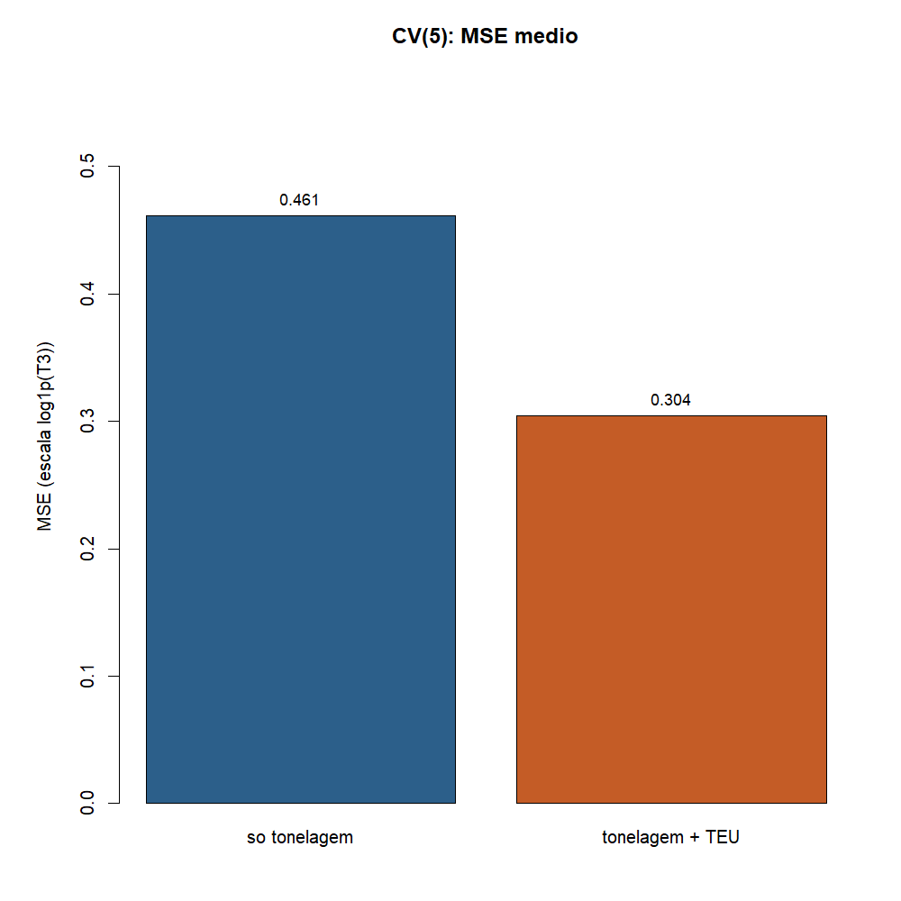
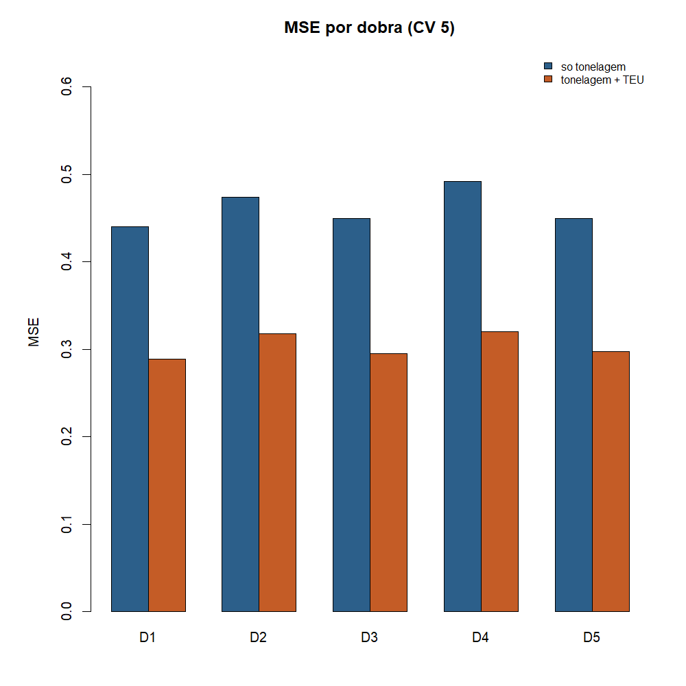
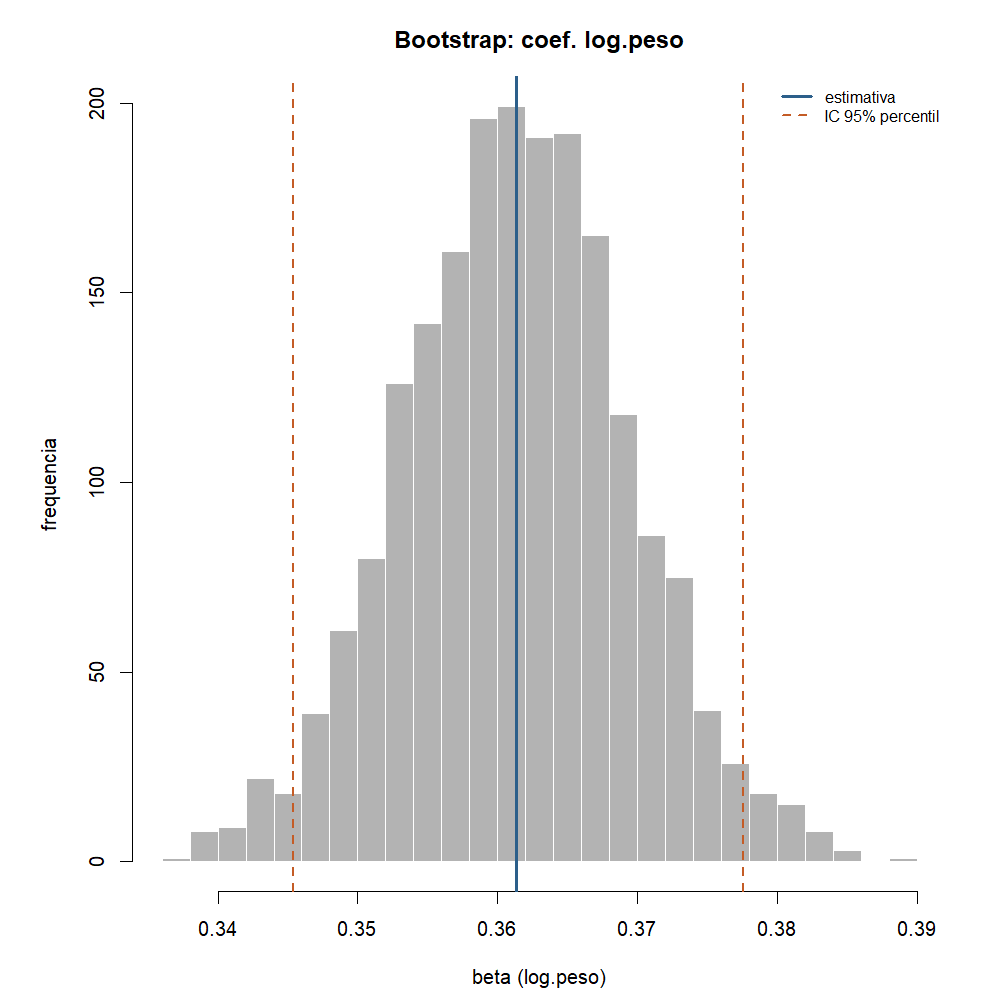
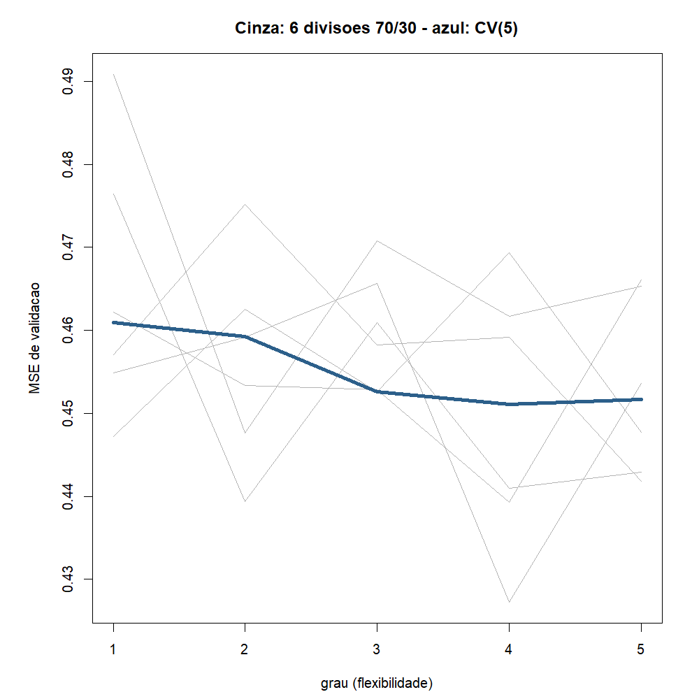

# Atividade 06 - Metodos de reamostragem

**Team Shannon · Teoria do Aprendizado Estatistico · Fatec Rubens Lara · Aula 07**

Continua a [05](05-avaliacao-selecao-modelos.md): la uma divisao 70/30
escolheu o modelo. Aqui a
[Aula 07](../materiais-aulas/Aula%2007%20-%20Métodos%20de%20Reamostragem.PDF)
troca a divisao unica por **validacao cruzada** e qualifica um
coeficiente com **bootstrap**.

Script: [`06-metodos-reamostragem.R`](../estrutura/codigos/06-metodos-reamostragem.R).
Números: [`06-numeros.txt`](../estrutura/codigos/06-numeros.txt).

---

## O funil

| # | Etapa | O que fizemos |
|---|---|---|
| 03a | Reta de T3 | tonelagem e TEU |
| 05 | Treino / teste | RMSE e escolha unica |
| 06 | Reamostragem | **esta entrega**: CV(5) + bootstrap |

---

## Recorte

Mesmo de 03a / 05: Santos 2024, carga, peso > 0, T3 ate P99.
n = 5.681. Y = `log1p(T3)`.

Mesmo com n grande, o laboratorio da aula pede reamostrar: media de
varias dobras e mais estavel que um sorteio so.

---

## Parte 1 - CV(5): qual candidato erra menos?

Ideia: embaralha, parte em k = 5 dobras. Em cada rodada, uma dobra e
validacao e as outras treinam. Cada escala valida **uma** vez.

```r
set.seed(1)
k <- 5
dobra <- sample(rep(1:k, length = nrow(dados)))

cv <- function(formula) mean(sapply(1:k, function(j) {
  m <- lm(formula, data = dados[dobra != j, ])
  mean((dados$y[dobra == j] - predict(m, dados[dobra == j, ]))^2)
}))

c(m1 = cv(y ~ log.peso),
  m2 = cv(y ~ log.peso + log.teu))
```

| Candidato | Formula | CV(5) = MSE medio | RMSE |
|---|---|---:|---:|
| m1 | so tonelagem | 0,461 | 0,679 |
| m2 | tonelagem + TEU | 0,304 | 0,551 |



**Vencedor: m2.** Confirma a Atividade 05, agora sem depender de um
unico sorteio 70/30.

### MSE por dobra

| Dobra | m1 | m2 |
|---|---:|---:|
| D1 | 0,440 | 0,289 |
| D2 | 0,474 | 0,318 |
| D3 | 0,449 | 0,295 |
| D4 | 0,492 | 0,320 |
| D5 | 0,450 | 0,297 |



Em todas as cinco dobras o m2 ganha. A dispersao entre dobras existe,
mas a media aponta um vencedor so - o contraste com varias divisoes
avulsas aparece no grafico 4.

### Por que k = 5

A aula recomenda k = 5 ou 10: equilibrio entre vies (treino pequeno
quando k e baixo) e variancia (dobras minúsculas quando k e alto).
Usamos k = 5.

---

## Parte 2 - Bootstrap: o coef. de tonelagem e firme?

Pergunta diferente da CV: **o coeficiente de `log.peso` mudaria muito
se tivessemos outra amostra de Santos 2024?**

```r
B <- 2000
set.seed(1)
b.peso <- replicate(B, {
  i <- sample(nrow(dados), nrow(dados), replace = TRUE)
  coef(lm(y ~ log.peso + log.teu, data = dados[i, ]))["log.peso"]
})
c(ep = sd(b.peso), quantile(b.peso, c(0.025, 0.975)))
```

| Estatistica | Valor |
|---|---:|
| beta observado (amostra) | 0,361 |
| erro padrao bootstrap | 0,008 |
| IC 95% percentil | 0,345 a 0,378 |



**Frase pedida pela aula:** o coeficiente de tonelagem e **distinguivel
de zero**. O intervalo 0,345-0,378 nao contém 0: mais peso empurra
`log1p(T3)` para cima de forma estavel nesta amostra.

---

## Divisao avulsa x CV (didatico)

Seis curvas cinza = seis sorteios 70/30 do grau de `poly(log.peso)`.
A linha azul = CV(5). As cinzas discordam; a azul estabiliza a escolha.



Com n grande a loteria e menos dramatica que no exemplo da aula
(n = 40), mas a mensagem e a mesma: uma divisao so oscila; a media das
dobras segura melhor.

---

## Vazamento na CV

Nao padronizamos nem imputamos na base inteira antes de dobrar. O corte
do P99 e o join peso/TEU ficam no recorte fixo da serie (como nas
entregas anteriores); dentro do laco so entram `lm` e o calculo do MSE
na dobra deixada de fora.

A CV substitui o conjunto de **validacao**, nao o de teste. Aqui o foco
do laboratorio e comparar candidatos e qualificar o coeficiente.

---

## Conclusao

1. CV(5): m2 (tonelagem + TEU) vence de novo (MSE 0,30 vs 0,46).
2. Bootstrap: coef. de `log.peso` ≈ 0,36; IC 95% 0,345-0,378; longe de zero.
3. Reamostrar responde duas perguntas: **qual metodo** (CV) e **quanta
   incerteza no numero** (bootstrap).
4. Proxima aula do curso: freio na flexibilidade (regularizacao).

---

## Como reproduzir

```r
Rscript estrutura/codigos/06-metodos-reamostragem.R
```

*Fonte: ANTAQ, Santos 2024.*
